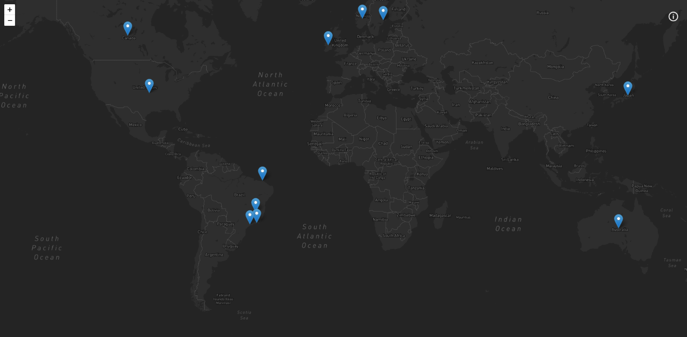

<h4 align="center">
  
</h4>

<br />

 <div align="center">
    <!-- LICENSE -->
    
    <!-- LAST COMMIT -->
    <a href="https://github.com/marcelo-rafael/my-next-trips/commits/master">
    
    </a>
    <!-- STARS -->
    <a href="https://github.com/marcelo-rafael/my-next-trips/stargazers/master">
    
    </a>
    <!-- FORKS -->
    <a href="https://github.com/marcelo-rafael/my-next-trips/forks/master">
    
    </a>
    <!-- AUTHOR -->
    
    <!-- LANGUAGES -->
    
    <!-- REPO SIZE -->
    
    <!-- CONTRIBUTORS -->
  
</div>

---

<h1 align="center">
My next trips - in construction
</h1>

<p align="center"><a href="https://my-next-trips.vercel.app/">Deploy on Vercel</a>.</p>

---

## 💻 About

The project lists the places on the map I will visit around the world.

## 📋 Features

- [x] Used map with Leaflet, React-leaflet and Mapbox to stylize..
- [x] Used GraphCMS as CMS.
- [x] Used GraphQl and GraphQl-Request to communicate with data.
- [x] Used Next.js for Front-end with static and dynamic page generation.
- [x] Used Next-PWA and Next-SEO.

---

## 🎨 Layout

## 💻  Web/mobile

<h4 align="center">
  
</h4>

---

## ⚔️ Challenges

- [x] Create documentation
  - [x] demo gif
  - [x] Readme-me amazing
  - [x] Technologies used
  - [x] Project Setup
  - [x] Features
  - [x] Add favicon
  - [x] responsive layout
  - [x] PWA
  - [x] SEO

---

## 🛠️ Tech Stack

The following tools were used in the construction of the project:

- **[React](https://pt-br.reactjs.org/)**
- **[TypeScript](https://www.typescriptlang.org/)**
- **[Styled-Components](https://styled-components.com/)**
- **[GraphQl](https://graphql.org/)**
- **[GraphQl-Request](https://github.com/prisma-labs/graphql-request)**
- **[Leaflet](https://leafletjs.com/)**
- **[React-Leaflet](https://react-leaflet.js.org/)**
- **[Next-PWA](https://github.com/shadowwalker/next-pwa)**
- **[Next-SEO](https://github.com/garmeeh/next-seo)**
- **[Nextjs.progressbar](https://www.npmjs.com/package/nextjs-progressbar)**
- **[Eslint](https://eslint.org/)**
- **[Husky](https://github.com/typicode/husky)**
- **[Jest](https://jestjs.io/pt-BR/)**
- **[Lint-Staged](https://github.com/okonet/lint-staged)**
- **[Prettier](https://prettier.io//)**
- **[@Testing-Library](https://testing-library.com/docs/react-testing-library/intro/)**
- **[@Graphql-codegen](https://www.graphql-code-generator.com/)**
- **[GraphCMS](https://graphcms.com/)**

---

## 🚀 How to run the project

### Prerequisites

Have an editor to work with the code like [VSCode](https://code.visualstudio.com/)

---

## 👯 Cloning the repository

```bash
# Clone this repository
$ git clone https://github.com/marcelo-rafael/my-next-trips

# Access the project folder in the terminal/cmd
$ cd my-next-trips

```

### Running the Application

```bash
# install dependencies
$ yarn or npm install

# Run Application in Development
$ yarn start or npm run start

# The application will open at port: 3000 - access http://localhost:3000
```

---

#### 📁 Config .ENV

```bash
# Add the .env.local file and environment variables as shown

# Token GraphCMS
GRAPHQL_HOST=
GRAPHQL_TOKEN=

# Token MapBox
NEXT_PUBLIC_MAPBOX_API_KEY=
NEXT_PUBLIC_MAPBOX_USERID=
NEXT_PUBLIC_MAPBOX_STYLEID=

```

---

## Commands

- `dev`: runs your application on `localhost:3000`
- `build`: creates the production build version
- `start`: starts a simple server with the build production code
- `lint`: runs the linter in all components and pages
- `test`: runs jest to test all components and pages
- `test:watch`: runs jest in watch mode

---

## 💪 How to contribute to the project

1. 🍴 Fork the project.
2. 👯 Clone this repository to your machine.
3. 🎋 Create a new branch with your changes: `git checkout -b my-feature`
4. ✅ Save the changes and create a commit message telling you what you've done: `git commit -m "feature: My new feature"`
5. 📌 Submit your changes: `git push origin my-feature`
6. 🔃 Create a new pull request

Once your pull request has been merged, you can delete `your-feature`

> If you have any questions, check out this [GitHub Contribution Guide](https://github.com/firstcontributions/first-contributions)

---

## 🤓 Autor


<div>
<a href="mailto:marcelo.rafael.goncalves@gmail.com">
      
   </a>
<a href="https://www.linkedin.com/in/marcelo-rafael-gonçalves/">
      
   </a>
<a href="https://github.com/marcelo-rafael">
  
  </a>
</div>

---

## 📝 LICENSE

This repository is licensed under the **MIT LICENSE**. For more detailed information, read the [LICENSE](./LICENSE) file contained in this repository.

<h3 align="center">
Made with ❤️ by <a href="https://www.linkedin.com/in/marcelo-rafael-goncalves/">Marcelo Rafael Gonçalves 💜🚀</a>
</h3>
